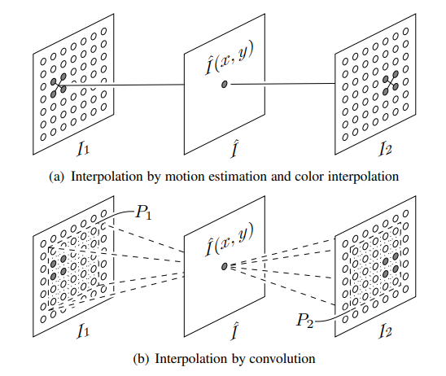
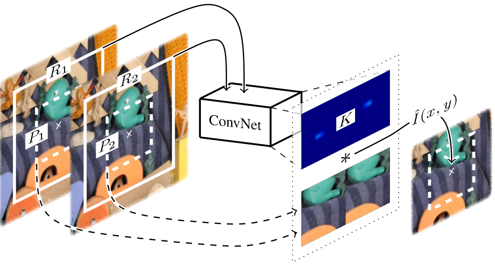

# Final Proposal

> Please remember to rename each subtitle 

## Introduction and diagram for the Video Frame Interpolation project
When we watch movies and TV shows online today, most of them are 24fps format. As most of our screens like monitors or television are 60hz or even 120hz frame rate or more, use Figure 1 as example. We will see some common artifacts on the screen if we watch these videos on our screen. The reason for the artifacts occurring is because the low frame rate video will lose moving detail during the movement.

 

To avoid these common artifacts we want to create a program that is powered by Video Frame Interpolation technology to convert 24fps video to 60fps video. This is a technology that aims to generate non-existent frames in-between the original frames. The usage of this technology can be used not only frame rate up-conversion but also the slow-motion video. 

Triditional video frame interpolation methods are using the estimate optical flow to predict the movement of the object between input frames and synthesizing intermediate frames. However the performance will be vary depends the quality of optical flow. Futhermore, the optical flow methods still challenging to generate high-quality frames due to large motion and occlusions. 

Since the goal of this project is to produce high-quality frame between existing frames, we decide to use the kernal based method to predict the frame. This method is to estimate spatially-adaptive convolution kernels for each output pixel and convolve the kernels with the input frames to generate a new frame. Specifically, for each pixel in the interpolated frame, the method takes two receptive field patches centered at that pixel as input and estimates a convolution kernel. The difference between these two method are shown as Figure 2.

As you can see in Figure 3, the object moves from one frame to the next frame. The model use kernal to draw the missing frame and then insert it in-between these two frames. The missing frame is generated by the CNN network with the other two frames as input.

 

For the test part, we will use 60fps frames videos to train our model as shown in Figure 4. Each video in the data set will be process in three set of rames:t, t+1, t+2, where t is from 1th frames to 58 frames. We will use the t frame and t+2 frame as input and t+1 frame as ground truth. The output frame will be used to compare with the original t+1 frame to accurately model.

 

## How it is related to Deep Learning for CV ...  - Qiming 
Traditional methods use optical flow for frame interpolation. However, in general, optical flow cannot be calculated from images with ambiguity (known as the aperture problem[6] in computer vision); additional constraints are needed to find a unique solution. Therefore, the quality of the interpolation heavily depends on the accuracy of the flow estimation. It is important to note that this work implements the work of Niklaus et al.[1]. on Adaptive Separable Convolution, which claims high-quality results on the video frame interpolation task. We design a convolutional neural network to estimate a proper convolutional kernel to synthesize each output pixel in the interpolated images. Instead of implementing optical flow-based interpolation, our method captures both the motion and interpolation coefficients, generates kernel through convolution layers, and synthesizes an intermediate video frame. 

Our neural network can be trained using widely available video data, which provides a sufficiently large training dataset. The main advantages of our method are: 
1. It achieves better transformation learning and better results; 
2. It learns models can learn on their own, while traditional video compression work requires a lot of manual design. 
The disadvantage of this method is: it requires a large amount of graphics memory.

## Steps 
    - research paper 
    - dataset 
    - env/demo (implementation) 
    - results analasys
There are several steps towards making the project. First, We are going to read some related articles and look into previous works on video frame interpolation. We are currently working on bring tradition video coding algorithms into this project, and adapt them into machine learning algorithms. Then, we can decide which approach we are going to take to prediction inter-frame images.  
Second, we need to decide which dataset we are going to use to train and test the neural network. Since we plan to convert lower FPS videos to 60FPS or 90FPS, we need to find some native 60FPS and 90 FPS video or corresponding picture frames.  
In addition, we are going to implement Niklaus's research method from scratch using Keras library on Ubuntu 18.04 with Anaconda. Also, we will develop a demo for quantitative analysis and generate videos for class presentation.  
Finally, we will run experiment on our demo against test data, or possibly previous research, such as Sepconv Slomo. Mstrics including MSE, PSNR, and SSIM will be used to quantify the results and evaluate the performance. A final report will be conducted to summarize our experience results. 
 
## Proposed Framework
We will develop a deep neural network based on Niklaus's Adaptive Convolution Network. As illustrated in Figure ?, the convolution layers will take in two receptive fields, R1 and R2, from two consecutive frames respectively.  

The convolutional model will be trained to output a kernal K, which will be used with the corresponding patches, P1 and P2,  centered in receptive fields, to compute the output pixel of the interpolated frame I_hat. The formula for computing the output pixel is shown as below:   

## Dataset
We will be training and testing our model using 720p video images from Middlebury dataset as Niklaus and DAIN did. It will allow us to do similar experiment or even comparison if possible. If more data is needed training, we will download as many 720p video as needed via YouTube.  

## Schedule
    - important dates
For the project schedule, we have planned the following dates and events at this moment. However, schedule may be slightly changed in the future according to the circumstances.
- April 23 (Thursday): Meeting and review on initial proposal
- April 27 (Monday): Initial proposal due
- May 7 (Thursday): Finish reading Chapter 6, 10, and 11 of the textbook. Daniel and Wang should finish reading the DAIN and Sepconv Slomo article and present it to the rest of the group
- May 7 (Thursday): Meeting on final proposal 
- May 9 (Saturday): Meeting and review on final proposal
- May 11 (Monday): Final proposal due
- May 11 (Monday): Meeting on coding plan
- May 24 (Sunday): Final code review
- May 26 (Tuesday): Final report review
- May 30 (Saturday): Presentation rehearsal
- June 1 (Monday): Presentation

## Results and Metrics
    - results: 24/25 -> 60, -> 90
    - compared with other works  
### Results:
We use our interpolation model to process the input videos with frame rate 24/25 fps to generate new videos with increased frame rate 60 and 90 fps. And the input videos are from a wide variety of video datasets with different resolutions.

1. Vimeo90K

2. UCF101

3. HD

4. Middlebury dataset

### Evaluation and Metrics:
To evaluate our interpolation model, the metrics shown below will be used to perform the evaluation in quantitative and qualitative perspectives:

- Quantitative Evaluation:

  - model parameters: the total size of the parameters used in the model
  
  - runtime: the runtime of frame interpolation on different resolution in the unit of second
  
  - MSE: Mean squared error
  
  - PSNR: Peak signal-to-noise ratio, the ratio between the maximum possible power of a signal and the power of corrupting noise that affects the fidelity of its representation.
  
  - SSIM: Structural similarity (SSIM) index is a method for predicting the perceived quality of various kinds of digital images and video. It is used for measuring the similarity between two images.
  
- Qualitative Evaluation:
  
  - Visual demonstration based on the image quality like the clear shape and the restored details.
  

Expected Outcomes:

  - a demo of playing the interpolated videos with higher frame rate while comparing against the original video
  - a report about our interpolation approach including its framework, implementation and evaluation

## Risks

In some cases the results generated by this method show the artifacts when the motion is larger than the size of the interpolation kernels. For example, the ghost effect could occur because the approach is not able to infer motion beyond the size of local kernels.

The training time could also take longer since it somehow depends on what hardware resources like GPU we would get for this project.

The graphics memory of GPU could be not enough for some data during training and testing.

## Reference  
- Bao, W., Lai, W. S., Ma, C., Zhang, X., Gao, Z., & Yang, M. H. (2019). Depth-aware video frame interpolation. In Proceedings of the IEEE Conference on Computer Vision and Pattern Recognition (pp. 3703-3712).
- Cote, R. (2016, February 22). Motion Interpolation On TVs: Soap Opera Effect. Retrieved April 26, 2020, from https://www.rtings.com/tv/tests/motion/motion-interpolation-soap-opera-effect.
- Epson Frame Interpolation. (n.d.). Retrieved April 26, 2020, from https://files.support.epson.com/docid/cpd5/cpd52094/source/adjustments/tasks/frame_interpolation.html.
- Florian Raudies (2013) Optic flow. Scholarpedia, 8(7):30724. Retrieved May 10, 2020, from http://www.scholarpedia.org/article/Optic_flow
- Niklaus, S., Mai, L., & Liu, F. (2017). Video frame interpolation via adaptive convolution. In IEEE Conference on Computer Vision and Pattern Recognition (pp. 670-679).
- Niklaus, S., Mai, L., & Liu, F. (2017). Video frame interpolation via adaptive separable convolution. In IEEE International Conference on Computer Vision (pp. 261-270).
- What Is The Soap Opera Effect? - Everything You Need To Know. (2019, June 10). Retrieved April 26, 2020, from https://www.displayninja.com/what-is-the-soap-opera-effect/.
