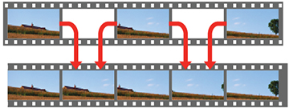

# Initial Proposal

> Please remember to rename each subtitle 

## Introduction and diagram for the Video Frame Interpolation project
When we watch movies and TV shows online today, most of them are 24fps format. As most of our screens like monitors or television are 60hz or even 120hz frame rate or more. We will see some common artifacts on the screen if we watch these videos on our screen. The reason for the artifacts occurring is because the low frame rate video will lose moving detail during the movement. 

 

To avoid these common artifacts we want to create a program that is powered by Video Frame Interpolation technology to convert 24fps video to 60fps video. This is a technology that aims to generate non-existent frames in-between the original frames. The usage of this technology can be used not only frame rate up-conversion but also the slow-motion video. 

As you can see in the picture below, the object moves from one frame to the next frame. The model will detect the movement and draw the missing frame and then insert it in-between these two frames. The missing frame is generated by the CNN network with the other two frames as input. 

 

For example, we will use 60fps frames videos to train our model. We use first frames and third frames as input and output a new frame. We will use this new frame to compare with the second frame to accurately model. 

 

## How it is related to Deep Learning for CV ...  - Qiming  

## Steps: - Daniel 
    - dataset 
    - research paper 
    - env/demo (implementation)  

## Schedule - Daniel  

## Results and associalted emtrics - Wang
    - results: 24/25 -> 60, -> 90
    - compared with other works  

## Risk - Wang  

## Reference  

Cote, R. (2016, February 22). Motion Interpolation On TVs: Soap Opera Effect. Retrieved April 26, 2020, from https://www.rtings.com/tv/tests/motion/motion-interpolation-soap-opera-effect

Epson Frame Interpolation. (n.d.). Retrieved April 26, 2020, from https://files.support.epson.com/docid/cpd5/cpd52094/source/adjustments/tasks/frame_interpolation.html

What Is The Soap Opera Effect? - Everything You Need To Know. (2019, June 10). Retrieved April 26, 2020, from https://www.displayninja.com/what-is-the-soap-opera-effect/